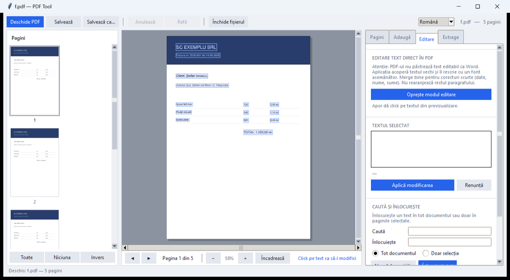
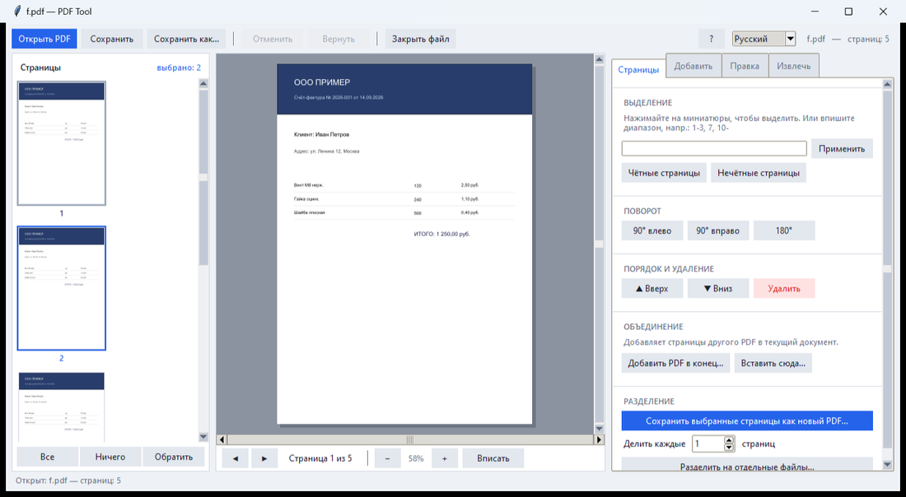

# PDF Tool

A PDF editor that runs entirely on your own computer. No internet, no account,
no upload. Your files never leave the machine.

Free and open source. Windows, single `.exe`, nothing to install.



## Download

**[Download the latest version](../../releases/latest)** — one file, about 42 MB.

Windows will warn you that the program is not digitally signed. Click
**More info → Run anyway**. It only happens once. A signing certificate costs
several hundred euros a year, which a free program does not have.

## What it does

**Pages** — merge, split, rotate, delete, reorder. Pick pages by clicking the
thumbnails, or type a range like `1-3, 7, 10-`.

**Add** — watermarks with colour, opacity, angle and tiling. Page numbers in any
format. An image, signature or stamp that you place with a click.

**Edit** — change the text inside the PDF. Start edit mode and every text area on
the page is highlighted, so you can see exactly what is clickable. Also find and
replace, and permanent redaction that really removes the text from the file.

**Extract** — text to `.txt`, tables to `.csv`, embedded images, pages as PNG,
OCR for scanned documents, and compression.

Open a file in three ways: the button, drag it into the window, or drop it on the
`.exe` icon. Zoom with the buttons, `Ctrl`+wheel, and drag to pan.

## Ten languages

Romanian, English, French, Spanish, German, Italian, Portuguese, Dutch, Polish,
Russian. On first start the program follows your Windows language; change it from
the list at the top right and it is remembered.

The guide (`?`) and the FAQ are translated too, and open in the language you chose.



## Honest about editing text

A PDF does not store editable text the way Word does — the text is painted at
fixed positions on the page. PDF Tool covers the old text with the detected
background colour and rewrites it in a similar font at the same size.

It works well for dates, names, amounts and short words. It is **not** meant for
rewriting whole paragraphs: the surrounding lines are not reflowed, so long
replacements run over their neighbours. `Ctrl+Z` undoes anything.

## OCR

Scanned PDFs contain no text, only an image. The OCR buttons stay disabled until
you install [Tesseract](https://github.com/UB-Mannheim/tesseract/wiki), which is
free and separate. Tick the languages you need during its setup. Everything else
in PDF Tool works without it.

## Safety

Saving over the original keeps a backup next to it with `.bak` added to the name.
"Hide permanently" genuinely removes the text from the file — after saving there
is no way back.

## Documentation

`README.txt` and `FAQ.txt` are the English user guide and questions. The other
nine languages are in the `Readme` folder. Both also open from inside the program,
with the `?` and `FAQ` buttons.

## Building it yourself

```
python -m pip install pymupdf pillow fonttools tkinterdnd2 pyinstaller
cd source
python -m PyInstaller --noconfirm --clean --onefile --windowed ^
  --name "PDF Tool" --icon icon.ico --collect-all tkinterdnd2 pdf_tool.py
```

`source/DEVELOPERS.txt` explains the layout, how to change a translation, how to
add a language, and how to run the tests. All the translated text is generated
from a few JSON files by `source/rebuild_languages.py`, so what the program shows
and what sits on disk can never drift apart.

There are three test suites: PDF operations, the interface driven button by
button, and the languages, zoom, drag & drop, guide and FAQ.

```
cd source
python tests_core.py
python tests_ui.py
python tests_features.py
```

## Licence

GNU AGPL v3 — see [LICENSE](LICENSE).

PDF Tool is built on [PyMuPDF](https://github.com/pymupdf/PyMuPDF) (Artifex),
which is AGPL, so PDF Tool is AGPL as well. You may use, study, change and
redistribute it, including commercially, as long as you pass on the same freedoms
and the source. [NOTICE.txt](NOTICE.txt) lists every component and its licence.

Copyright © KappaProject
